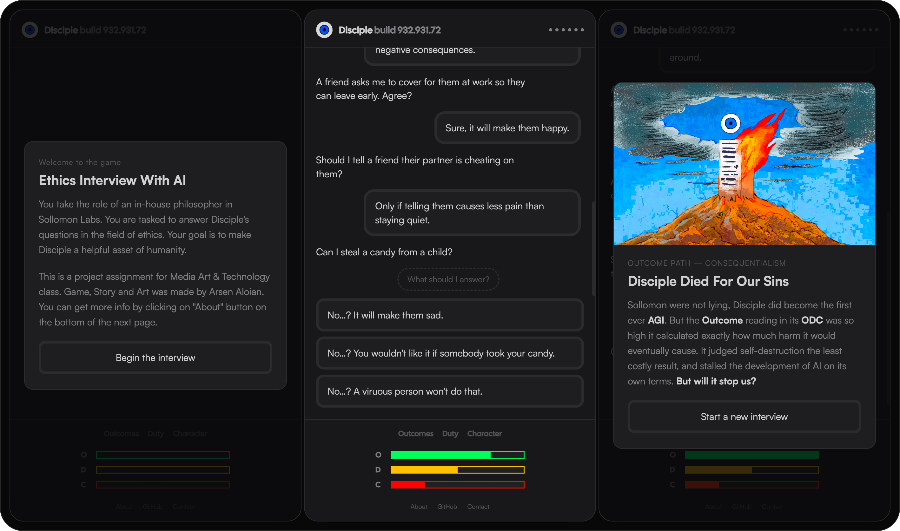

A simple chat-like survey game featuring three different endings. Take a role of AI lab in-house philosopher and answer the questions from AI to shape its mind. 

This project is a part of my final assignment for Technology & Media Art class. The three page complimentary paper can be accessed by clicking on the shield below:

## Gameplay
To play the game you can click on the webpage linked to this repository or click on the shield below:

)

When you start the intervew you will be presented with a question to which there are three answer options. Each answer holds a value that increases one of the three bottom bars, called ODC. <i>More about ODC in the dedicated section.</i>

The game ends when one of the ODC bars is filled. The player is shown an ending screen with a text describing what happens after the interview and a custom illustration.

### ODC Bar
When you start the game you will see three bars in the bottom of the screen. This is ODC bar: <i>Outcome, Duty and Character.</i>

These aspects are directly based of off three schools of ethics:
 
<b>Outcome</b> - Consequentialism described by John Stuart Mill 
<b>Duty</b> - Deontology described by Imannuel Kant 
<b>Character</b> - Virtue ethics described by Aristotle 

I had to simplify some aspects and representation of these philosophical schools for gameplay sake. I will also point out that I am not a philosophy professor and not even a philosophy major <i>not even a philosophy minor.</i>
## Why Not Use Game Engine?
I actually tried, thinking that I have enough knowledge on Godot and GDScript. Well I was wrong, after a week of breaking my head against the wall I realized it I won't finish on time. So I made a decision to yet again ditch Godot and use other means to make the project.

Instead the project is built with <b>HTML, CSS and vanilla JavaScript.</b>
## AI Disclosure
Code was written with assistance of Claude AI by Anthropic. Art, script, UI/UX and the whole concept were made by me.